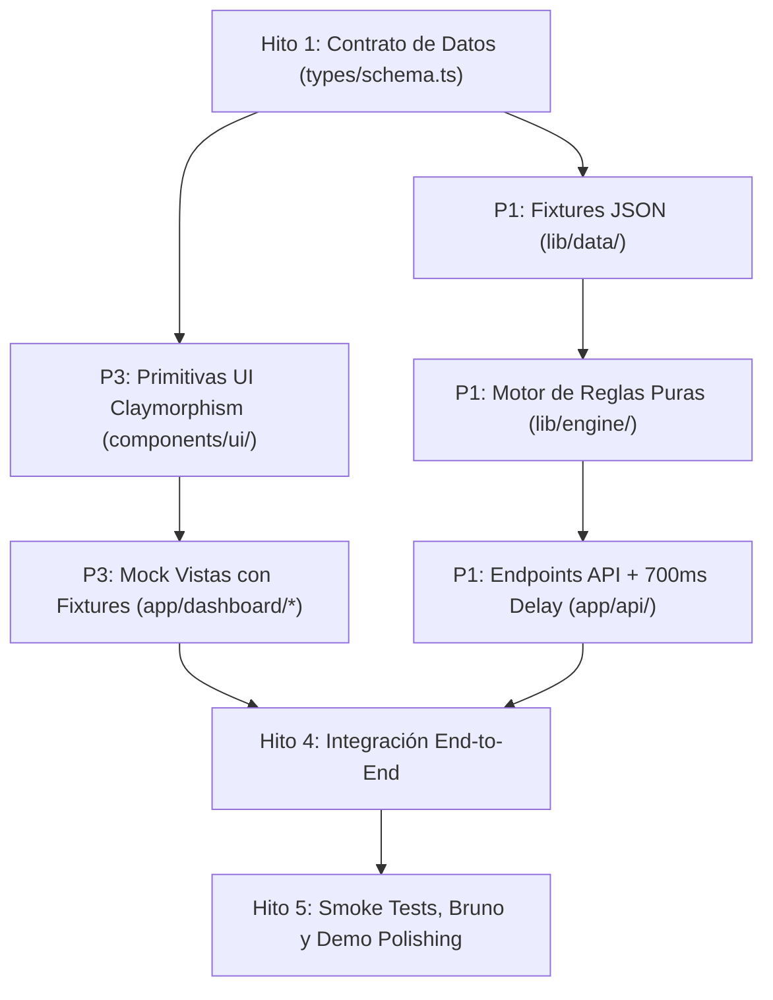

# EcoStream · Faspy: Diagnóstico de Estado y Checklist para el MVP

> **Entorno:** Hackathon Capital One EcoStream  
> **Alcance de este repositorio:** Backend / Motor de Simulación (`app/api`, `lib/engine`) y Dashboard (`app/dashboard`).  
> **Filosofía central:** Simulación determinista sin backend real, sin base de datos real y sin conexión a SAT/SPEI/OFAC.

---

## 1. Diagnóstico del Estado Actual ("Qué tenemos ahorita")

Se realizó un recorrido completo del código, build y pruebas (`pnpm check` pasó al 100% en verde). El repositorio se encuentra actualmente en la fase de **fundación arquitectónica limpia (Scaffolding)**:

```
faspy/
├── app/
│   ├── api/
│   │   └── health/route.ts          ✅ OK (Healthcheck + CORS validado)
│   ├── dashboard/
│   │   ├── layout.tsx               🟡 Shell básico (sin estética táctil/clay completa)
│   │   ├── page.tsx                 🟡 Placeholder ("En preparación")
│   │   ├── cumplimiento/page.tsx    🟡 Placeholder ("En preparación")
│   │   ├── decision/page.tsx        🟡 Placeholder ("En preparación")
│   │   └── mercado/page.tsx         🟡 Placeholder ("En preparación")
├── lib/
│   ├── api/response.ts              ✅ OK (CORS para ERP_ORIGIN, apiJson, apiOptions)
│   ├── data/                        ❌ Vacío (Solo README, sin fixtures JSON)
│   └── engine/                      ❌ Vacío (Solo README, sin reglas ni algoritmos)
├── types/
│   └── schema.ts                    🟡 Incompleto (Solo HealthResponse y ApiError)
├── components/
│   ├── dashboard/
│   │   └── module-placeholder.tsx   🟡 Placeholder básico
│   └── ui/
│       └── panel.tsx                🟡 Wrapper preliminar de `.clay-panel`
├── styles/
│   └── tokens.css                   ✅ Tokens de color y sombras según DESIGN.md
└── tests/ & scripts/
    ├── api.test.mts                 ✅ Pruebas unitarias de CORS y respuestas JSON
    └── smoke.mjs                    ✅ Smoke tests HTTP activos
```

### Resumen del avance actual vs MVP:
| Capa | Estado Actual | Meta MVP | Brecha (% pendiente) |
|---|---|---|:---:|
| **Infraestructura & CI** | Next.js 16, TypeScript, Tailwind 4, scripts de validación, CORS. | Completada. | **0%** |
| **Contrato de Datos (`types/schema.ts`)** | Sincronizado al 100% con `erp-faspy` (CFDI, Factoraje, Compliance, Scoring, Anticipo y Liquidación). | Contrato CFDI, Factoraje, Compliance, Scoring y Métricas. | **0%** |
| **Fixtures Sintéticos (`lib/data/`)** | README vacío. | Listas SAT 69-B, OFAC, catálogo deudores, facturas sintéticas. | **100%** |
| **Motor de Simulación (`lib/engine/`)** | README vacío. | Funciones puras: validación fiscal, scoring crediticio, aforo/descuento. | **100%** |
| **Endpoints API (`app/api/`)** | Solo `/api/health`. | `/api/emitir-factura` (+700ms), `/api/validar`, `/api/scoring`. | **80%** |
| **Dashboard UI (`app/dashboard/`)** | 4 pantallas con placeholders. | Centro de Operaciones, Cumplimiento, Matriz de Decisión y TAM/SAM con componentes Claymorphic e interactividad. | **85%** |

---

## 2. El Cuello de Botella Crítico (Hito #1: RESUELTO ✅)

> [!NOTE]
> **Sincronización del Contrato `types/schema.ts` Completada**:
> El archivo `types/schema.ts` ha quedado sincronizado como espejo exacto con `erp-faspy`.
> Se modelaron los contratos para:
> 1. Factura / CFDI emitido (`InvoiceCFDI` plano: `monto_mxn`, `cliente`, `rfc_cliente`, `plazo_dias`, `uuid_cfdi`).
> 2. Resultado de Validación de Cumplimiento (`ComplianceReport`: `cfdi_status`, `efos_status`).
> 3. Oferta de Factoraje & Scoring (`EmitirFacturaResponse`: `score`, `monto_anticipo`, `tasa_aplicada`, `dias_promedio_pago`, `clabe_virtual`, `decision`).
> 4. Flujo de anticipo y liquidación (`AceptarAnticipoRequest`, `AnticipoConfirmado`, `SimularPagoRequest`, `ResultadoPago`).

---

## 3. Checklist y Tareas por Rol

### 🟦 Frente P1: Motor de Simulación, Datos y API
*Responsable de la lógica pura, datos sintéticos y endpoints HTTP.*

- [x] **Tarea 1.1: Definición de Esquemas (`types/schema.ts`)**
  - [x] Modelar `InvoiceCFDI`, `ComplianceReport`, `ScoringDecision`, `EmitirFacturaRequest` y `EmitirFacturaResponse`.
  - [x] Sincronizar contrato con `erp-faspy/types/schema.ts` (espejo exacto, plano, serialización de CLABE y validado con tests).
  - [x] Añadir casos de compilación y pruebas en `tests/schema.test.mts`.
  - [x] Actualizar documentación de contrato y colección Bruno (`docs/faspy/contract.md`).
- [ ] **Tarea 1.2: Fixtures Sintéticos Deterministas (`lib/data/*.json`)**
  - [ ] `sat-69b.json`: Lista de RFCs simulados clasificados (empresas fantasma EFOS/EDOS vs limpias).
  - [ ] `ofac-sanctions.json`: Lista de personas/entidades simuladas para sanción internacional.
  - [ ] `debtors.json`: Catálogo de 5-10 pagadores clave con historial crediticio, días promedio de pago y calificación.
  - [ ] `invoices-history.json`: Lote de 15-20 facturas con estados diversos para precargar el dashboard.
- [ ] **Tarea 1.3: Motor Puro de Simulación (`lib/engine/*.ts`)**
  - [ ] `compliance.ts`: Validación de RFC contra 69-B y OFAC; validación sintáctica de CFDI y CLABE SPEI.
  - [ ] `scoring.ts`: Algoritmo determinista de scoring en base al pagador, monto y plazo (30/60/90 días).
  - [ ] `factoring.ts`: Cálculo financiero del factoraje:
    $$\text{Desembolso} = \text{Monto Factura} \times \text{Aforo} \times (1 - \text{Tasa Descuento}) - \text{Comisión}$$
- [ ] **Tarea 1.4: Endpoints de la API (`app/api/*`)**
  - [ ] `POST /api/emitir-factura`:
    - Simular latencia obligatoria: `await new Promise(r => setTimeout(r, 700))`.
    - Ejecutar motor de cumplimiento y scoring.
    - Responder con código 200/201 tipado según `schema.ts`.
  - [ ] `GET /api/compliance/audit`: Listado de auditoría de facturas validadas.
  - [ ] `POST /api/scoring/simulate`: Endpoint para recálculo dinámico desde el slider del dashboard.
- [ ] **Tarea 1.5: Pruebas y Colección Bruno**
  - [ ] Añadir peticiones en `docs/faspy/collections/api/` (`emitir-factura.yml`, `scoring.yml`, etc.).
  - [ ] Agregar tests unitarios en `tests/engine.test.mts` para las reglas puras.
  - [ ] Extender `scripts/smoke.mjs` con los nuevos endpoints POST.

---

### 🟩 Frente P3: Dashboard, Visualización y Experiencia (UI)
*Responsable de la interfaz táctil Claymorphic, tableros y analítica.*

- [ ] **Tarea 3.1: Primitivas del Sistema Visual (`components/ui/*`)**  
  *(Alinear al 100% con [DESIGN.md](../DESIGN.md))*
  - [x] `PillButton` / `Button`: Botones primarios (Sovereign Blue `#004977`) y secundarios (Mint `#10B981`) con sombras táctiles y respuesta elástica `scale(0.97)`.
  - [x] `MetricCard`: Tarjetas de estadísticas con elevación Tier 1, direct specular highlight y números en `JetBrains Mono`.
  - [x] `BadgeStatus`: Chips para semáforo de cumplimiento (Verde: Validado, Rojo: 69-B / Alerta, Amarillo: Revisión).
  - [x] `TactileSlider`: Slider de velocidad de factoraje (aforo/días) con riel sunken y thumb pill extruded.
  - [x] `SegmentedControl`: Selector flotante estilo Apple Fluid para cambiar plazos o filtros.
- [x] **Tarea 3.2: Módulo Centro de Cumplimiento (`app/dashboard/cumplimiento/`)**
  - [x] KPI Ribbon: Tasa de aprobación fiscal, alertas 69-B detectadas, verificación OFAC y tiempo medio de resolución.
  - [x] Data Rows táctiles: Listado de facturas procesadas con chips de estado SAT/OFAC/SPEI.
  - [x] Detalle expandible/modal: Vista detallada de evidencia de validación (por qué se rechazó o aprobó un RFC).
- [ ] **Tarea 3.3: Módulo Matriz de Decisión & Underwriting (`app/dashboard/decision/`)**
  - [ ] Simulador Interactivo de Factoraje: Control interactivo para mover monto, plazo o aforo y ver el impacto instantáneo en liquidez vs costo financiero.
  - [ ] Scorecard de Deudor: Gráfico o tabla de ratings (A, B, C, D) con límites de exposición y tasas asignadas.
  - [ ] Visualización del flujo de fondos (Diagrama o steps: Factura emitida ➔ Validación ➔ Desembolso inmediato en T+0).
- [ ] **Tarea 3.4: Módulo TAM / SAM / SOM (`app/dashboard/mercado/`)**
  - [ ] Desglose visual del mercado de factoraje en México (TAM: Valor de facturación B2B; SAM: Factoraje accesible a PyMEs; SOM: Objetivo EcoStream).
  - [ ] Calculadora de impacto económico: Ganancia de días de caja (DSO reducido de 75 a 1 día) y retorno para la empresa.
- [ ] **Tarea 3.5: Centro de Operaciones / Resumen General (`app/dashboard/page.tsx`)**
  - [ ] Vista ejecutiva unificada: Widgets que conectan Cumplimiento, Decisión de Liquidez y Métricas clave.
  - [ ] Feed en vivo simulado de transacciones recientes.
- [ ] **Tarea 3.6: Layout y Navegación Flotante (`app/dashboard/layout.tsx`)**
  - [ ] Mejorar la barra de navegación `glass-bar` para mostrar rutas activas, estado del simulador ("Modo: Simulación Activa") y acceso rápido a los 3 submódulos.

---

## 4. Hoja de Ruta de Ejecución Recomendada (Roadmap)



### Paso 1: Bloqueador Inicial (Inmediato)
- P1 y el encargado del ERP aprueban los tipos en [`types/schema.ts`](../types/schema.ts).
- P1 crea los archivos JSON sintéticos en [`lib/data/`](../lib/data) para que ambos (backend y frontend) tengan datos reales de trabajo.

### Paso 2: Desarrollo Paralelo
- **P1**: Construye `lib/engine/compliance.ts` y `lib/engine/scoring.ts` con pruebas unitarias (`pnpm test`).
- **P3**: Construye las primitivas visuales y las 3 pantallas en `app/dashboard/` consumiendo directamente los JSON de `lib/data/` (así el dashboard luce espectacular sin depender de que la API esté lista).

### Paso 3: Endpoints API y Conexión
- **P1**: Monta las rutas `app/api/emitir-factura/route.ts` consumiendo el motor y agregando la latencia de 700 ms simulada y CORS verificado.
- **P1**: Añade las solicitudes en Bruno (`docs/faspy/collections/api/`).

### Paso 4: Demo Final y Validación
- Ejecutar `pnpm check` y `pnpm test:smoke`.
- Conectar una prueba de emisión desde el ERP al simulador y observar cómo se refleja el estado de cumplimiento y la oferta de factoraje en el dashboard.
